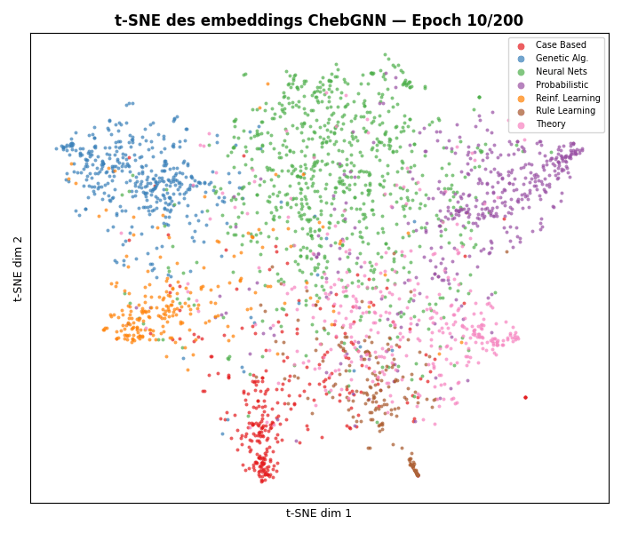

# 🪐 Spectral GNN From Scratch


A clean, from-scratch implementation of a **Spectral Graph Neural Network** (based on [ChebNet](https://arxiv.org/abs/1606.09320)). 

This project bridges the gap between **pure mathematics** (Graph Signal Processing, Spectral Graph Theory) and **software engineering**. It is built using only raw PyTorch tensors and NumPy, completely bypassing high-level libraries like PyTorch Geometric (PyG) to demonstrate a deep, fundamental understanding of how GNNs actually work under the hood.

## 🧠 The Math Behind The Code

Instead of spatial message-passing, this project implements graph convolutions in the **Fourier domain** using the Graph Laplacian.

### 1. The Normalized Graph Laplacian
The foundation of spectral graph theory. Given an Adjacency matrix $A$ and a Degree matrix $D$, the normalized Laplacian $\mathcal{L}$ is computed as:
$$\mathcal{L} = I - D^{-1/2} A D^{-1/2}$$

### 2. Spectral Filtering & Eigen-Decomposition
A strict graph convolution requires the eigen-decomposition of the Laplacian ($\mathcal{L} = U \Lambda U^T$), which is computationally expensive $\mathcal{O}(N^3)$. The true spectral convolution of a signal $x$ with a filter $g_\theta$ is:
$$y = U g_\theta(\Lambda) U^T x$$
*(Note: A strict spectral filter module is included in this repo for educational purposes).*

### 3. The Chebyshev Approximation (ChebNet)
To avoid the $\mathcal{O}(N^3)$ bottleneck, we approximate the spectral filter using **Chebyshev polynomials** $T_k(x)$ up to order $K$, reducing the complexity to $\mathcal{O}(K|E|)$:
$$T_k(x) = 2x T_{k-1}(x) - T_{k-2}(x)$$

## 🚀 Features
- **Raw Matrix Operations:** Manual computation of $A$, $D$, and $\mathcal{L}$ from edge indices.
- **Strict Spectral Convolution:** Implementation of the exact Fourier transform on graphs using `torch.linalg.eigh`.
- **Chebyshev Convolution:** Highly optimized `ChebConv` layer mimicking the math of Defferrard et al. (2016).
- **Semi-Supervised Node Classification:** Full training loop implemented on the Cora dataset.
- **Latent Space Visualization:** Dimensionality reduction tracking the node embeddings over epochs.

## 📊 Results on Cora Dataset

*The model achieves **78.2% test accuracy** on Cora, matching the performance reported in Defferrard et al. (2016), fully computed through custom tensor algebra without any GNN framework.*

### Embeddings Evolution (t-SNE)
Watch how the Spectral GNN progressively separates the 2708 academic papers into their 7 categories over 200 epochs — based entirely on graph topology and node features:



## 🛠️ How to Run

1. Clone the repository:
   ```bash
   git clone https://github.com/governor08/spectral-gnn.git
   cd spectral-gnn
   ```
2. Install dependencies:
   ```bash
   pip install torch numpy networkx matplotlib scikit-learn
   ```
3. Run training:
   ```bash
   python main.py
   ```
4. Full pipeline (training + benchmark + t-SNE GIF):
   ```bash
   python main.py --benchmark --visualize
   ```

## 📚 References
- [Convolutional Neural Networks on Graphs with Fast Localized Spectral Filtering (Defferrard et al., 2016)](https://arxiv.org/abs/1606.09320)
- [Semi-Supervised Classification with Graph Convolutional Networks (Kipf & Welling, 2017)](https://arxiv.org/abs/1609.02907)
