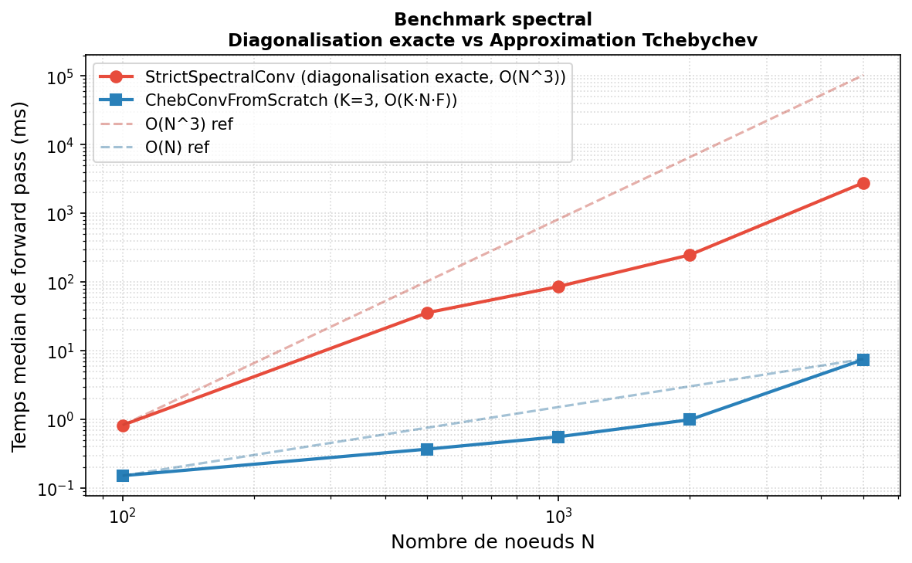
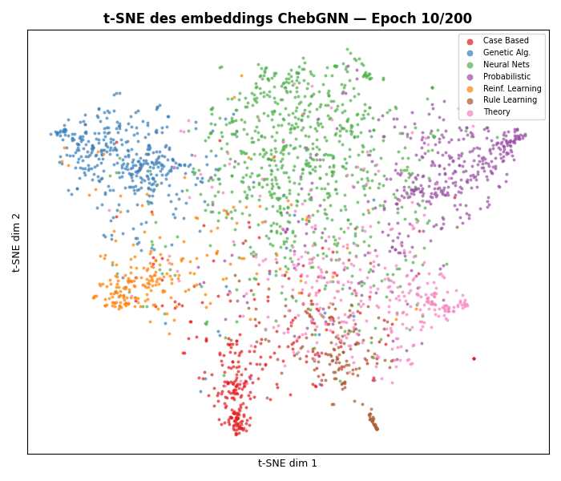

# Spectral GNN From Scratch


A from-scratch implementation of a **Spectral Graph Neural Network** based on [Defferrard et al. (2016) — ChebNet](https://arxiv.org/abs/1606.09320), applied to semi-supervised node classification on the Cora citation graph.

Most people use PyTorch Geometric and call `.forward()`. This project goes one level deeper — every operator is built by hand: adjacency matrix, normalized Laplacian, power iteration for λ_max, and the full Chebyshev polynomial recursion. No GNN framework. Just matrix algebra and PyTorch tensors.

---

## The Math

Instead of spatial message-passing, graph convolutions are performed in the **spectral domain** using the Graph Laplacian.

### 1. Normalized Graph Laplacian
Given adjacency matrix $A$ and degree matrix $D$:
$$\mathcal{L} = I - D^{-1/2} A D^{-1/2}$$

Eigenvalues of $\mathcal{L}$ lie in $[0, 2]$ and encode the graph's frequency content — low eigenvalues correspond to smooth signals across the graph, high eigenvalues to sharp transitions between neighbors.

### 2. Exact Spectral Convolution (O(N³))
The theoretically correct spectral filter requires a full eigendecomposition $\mathcal{L} = U \Lambda U^T$:
$$y = U \, g_\theta(\Lambda) \, U^T \, x$$

This is implemented in `StrictSpectralConv` for educational purposes — but is computationally infeasible at scale.

### 3. Chebyshev Approximation — ChebNet (O(K|E|))
To sidestep the O(N³) bottleneck, the spectral filter is approximated with Chebyshev polynomials up to order $K$:
$$y = \sum_{k=0}^{K-1} \theta_k \, T_k(\tilde{\mathcal{L}}) \, x$$

where $\tilde{\mathcal{L}} = \frac{2}{\lambda_{\max}} \mathcal{L} - I$ rescales eigenvalues to $[-1, 1]$, and the recursion $T_k(x) = 2x\,T_{k-1}(x) - T_{k-2}(x)$ requires only sparse matrix-vector products. $\lambda_{\max}$ is estimated via **power iteration** — no full eigendecomposition needed.

---

## Results on Cora

**78.2% test accuracy** — matching the result reported in the original ChebNet paper, computed entirely through custom tensor algebra.

| Method | Test Accuracy | Complexity |
|---|---|---|
| StrictSpectralConv (exact) | ~78% | O(N³) |
| ChebConvFromScratch (K=3) | **78.2%** | O(K\|E\|) |
| Defferrard et al. (2016) reported | 81.2% | O(K\|E\|) |

### Speed Benchmark — Exact vs. Chebyshev

The plot below shows why the Chebyshev approximation matters in practice. On large graphs, the exact diagonalization becomes completely impractical while ChebConv stays linear:



### Embeddings Evolution (t-SNE over 200 epochs)

Watch the 2708 Cora papers progressively separate into their 7 categories as the model trains — driven entirely by graph structure and node features:



---

## Project Structure

```
spectral-gnn/
├── main.py               # Entry point — training + optional benchmark/visualization
├── src/
│   ├── graph_math.py     # A, D, L construction — power iteration — rescaling
│   ├── layers.py         # StrictSpectralConv + ChebConvFromScratch
│   ├── model.py          # ChebGNN (2-layer architecture)
│   ├── train.py          # Training loop + embedding snapshots
│   ├── data_loader.py    # Cora parser + semi-supervised splits
│   ├── benchmark.py      # Speed comparison: exact vs. Chebyshev
│   └── visualize.py      # t-SNE animation generator
├── data/cora/            # Raw Cora dataset (auto-downloaded)
└── report/               # Outputs: benchmark.png, tsne_animation.gif
```

---

## How to Run

**1. Clone and install**
```bash
git clone https://github.com/governor08/spectral-gnn.git
cd spectral-gnn
pip install torch numpy networkx matplotlib scikit-learn
```

**2. Train the model**
```bash
python main.py
```

**3. Full pipeline — training + benchmark + t-SNE GIF**
```bash
python main.py --benchmark --visualize
```

**4. GPU training**
```bash
python main.py --device cuda
```

All figures are saved to `report/`.

---

## References
- [Convolutional Neural Networks on Graphs with Fast Localized Spectral Filtering — Defferrard, Bresson, Vandergheynst (2016)](https://arxiv.org/abs/1606.09320)
- [Semi-Supervised Classification with Graph Convolutional Networks — Kipf & Welling (2017)](https://arxiv.org/abs/1609.02907)
